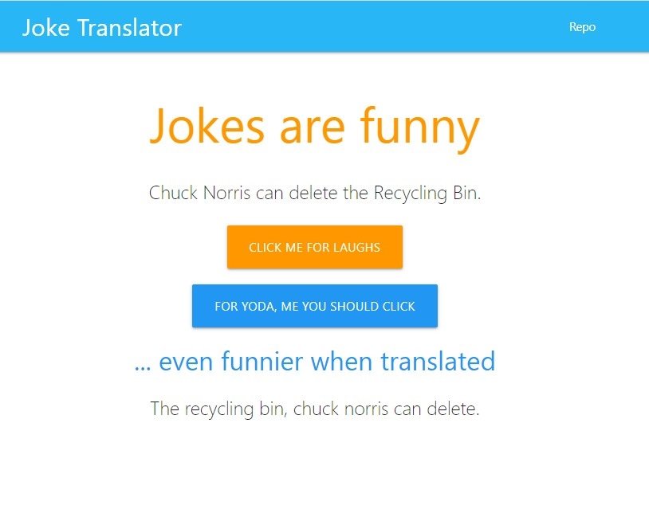

# Joke Translator
### Authored by:
- James Kamau
- Daniel Moretz
- Sonia Nyenkan
- Robert Campbell Van Vliet II
- D. Caine Winters

## Links
### [Link to repo](https://github.com/sfrancesny/Joke-Translator)
### [Link to finished product](https://sfrancesny.github.io/Joke-Translator/)

## Joke Translator app use
- Click on click-me-for-laugh button to display joke above button.
- Click on Yoda button for current joke displayed above to be translated and displayed below.
- Repo link in upper right quadrant will open a new tab in user's browser at the GitHub repo.
- Clear-storage link in upper right quadrant will clear local storage and refresh page -- any stored-joke tiles will be cleared.
- Team bio and hyperlinked collaborators displayed in footer.
    - Collaborator links will open new tabs at each of their portfolio pages.

## External Server-side APIs
### [JOKES](https://github.com/sameerkumar18/geek-joke-api)
- Simple endpoint that returns a random geeky joke.  This API was very easy to use, did not require registering or obtaining an API key, and did not fail at any time.
### [TRANSLATIONS](https://funtranslations.com/api/)
- This endpoint offered a lot of different translations.  There is general/limited-use API that did not require a key, but the limits were quickly reached.  One of our developers paid for an API key that afforded an increased limit threshold, but even this was quickly reached.

## Acknowledged sources
- [Materialize](
https://materializecss.com/getting-started.html) template used as starting point for code base

## Screenshot of Joke Translator app

