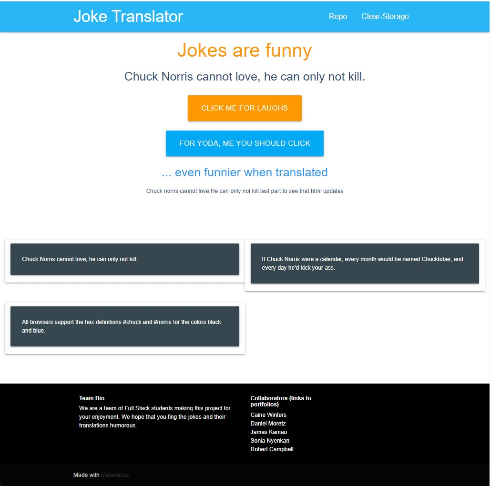

# Joke Translator
# Authored by:
- James Kamau
- Daniel Moretz
- Sonia Nyenkan
- Robert Campbell Van Vliet II
- D. Caine Winters

### Screenshot of Joke Translator app

## Links
### [Link to repo](https://github.com/sfrancesny/Joke-Translator)
### [Link to finished product](www.google.com)

### Joke Translator app use
- Click on click-me-for-laugh button to display joke above button.
- Click on Yoda button for current joke displayed above to be translated and displayed below.
- Repo link in upper right quadrant. 

### Acknowledged sources
- [Materialize](
https://materializecss.com/getting-started.html) template used as starting point for code base
